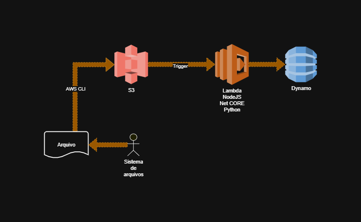

# Desafio-AWS-EC2
# ☁️ Desafio - Gerenciamento de Instâncias EC2 na AWS

Este repositório é parte do **desafio de projeto do bootcamp Santander Code Girls 2025 (DIO)**.  
Aqui eu registrei tudo o que aprendi na prática sobre **instâncias EC2**, **AMIs** e **Snapshots EBS**, incluindo prints das etapas e diagramas de arquitetura criados no **Draw.io**.

---

## 🎯 Objetivos do desafio
- Criar e configurar uma instância **EC2** do zero.  
- Gerar uma **AMI personalizada**.  
- Criar e restaurar **Snapshots EBS**.  
- Desenhar arquiteturas na nuvem usando serviços da AWS.  
- Documentar o processo em um repositório no GitHub.  

---

## 📝 Etapas que eu realizei
*(detalhes da EC2, AMI e Snapshot, como já combinamos… pode manter os prints aqui se quiser)*

---

## 🏗️ Diagramas de Arquitetura

### 📌 Diagrama 1 – Fluxo de arquivos com S3, Lambda e DynamoDB

**Descrição do fluxo:**  
1. O **usuário** ou sistema envia um arquivo para o **Amazon S3** (via AWS CLI ou upload).  
2. Esse upload gera um **gatilho (Trigger)** que dispara uma função no **AWS Lambda**.  
3. O Lambda pode ser programado em **NodeJS, .NET Core ou Python**, e processa o arquivo ou seus metadados.  
4. Após o processamento, os dados estruturados são enviados e armazenados no **DynamoDB**.  

**Funcionalidades principais:**  
- **S3** → Armazenamento de objetos/arquivos.  
- **Lambda** → Execução de código sob demanda, sem precisar de servidor dedicado.  
- **DynamoDB** → Banco de dados NoSQL escalável e de baixa latência.  

---

### 📌 Diagrama 2 – Integração entre EC2, EBS e RDS

**Descrição do fluxo:**  
1. O **usuário** acessa a aplicação hospedada em uma instância **EC2**.  
2. Essa instância utiliza volumes **EBS** (armazenamento em bloco) para leitura e escrita de dados.  
   - Um volume pode ser usado para armazenar dados de entrada (D-EBS).  
   - Outro volume pode ser usado para saída ou redundância (E-EBS).  
3. O EC2 também está conectado ao **Amazon RDS**, que fornece persistência em banco de dados relacional.  
4. Todo o ambiente está dentro da nuvem **AWS**, garantindo disponibilidade e escalabilidade.  

**Funcionalidades principais:**  
- **EC2** → Servidor virtual na nuvem.  
- **EBS** → Armazenamento em bloco, permite snapshots e recuperação de dados.  
- **RDS** → Serviço de banco de dados relacional gerenciado.  

---

## 📘 O que aprendi
- Como diferentes serviços da AWS se conectam para formar soluções completas.  
- Que **S3 + Lambda + DynamoDB** são ideais para soluções serverless.  
- Que **EC2 + EBS + RDS** simulam uma arquitetura tradicional, mas com recursos de nuvem.  
- A importância de documentar fluxos com diagramas para entender melhor a arquitetura.  

---

## 📚 Recursos que usei
- [AWS EC2 - Guia Oficial](https://docs.aws.amazon.com/AWSEC2/latest/UserGuide/concepts.html)  
- [Amazon S3](https://docs.aws.amazon.com/AmazonS3/latest/userguide/Welcome.html)  
- [AWS Lambda](https://docs.aws.amazon.com/lambda/latest/dg/welcome.html)  
- [Amazon DynamoDB](https://docs.aws.amazon.com/amazondynamodb/latest/developerguide/Introduction.html)  
- [Amazon RDS](https://docs.aws.amazon.com/AmazonRDS/latest/UserGuide/Welcome.html)  

---

## 👩‍💻 Autora
Sou **Julia Oliveira**, estudante de tecnologia e participante do **Santander Code Girls 2025**.  
Este repositório faz parte da minha jornada aprendendo cloud, DevOps e boas práticas em AWS. 🚀  
